<!-- ✨ Animated Banner ✨ -->
<picture>
  <source media="(prefers-color-scheme: dark)" srcset="./banner.svg?v=2">
  <source media="(prefers-color-scheme: light)" srcset="./banner-light.svg?v=2">
  
</picture>

 

<table align="center" border="0">
<tr>
<td width="38%" align="center" valign="middle">

<!-- 🪪 Swinging Lanyard ID Card (React Bits style, pure SVG) -->

</td>
<td width="62%" valign="middle">

### 💻 My Projects

| 🚀 Project | 🛠 Tech | ⭐ |
|:---|:---:|:---:|
| [🎵 AirBeats](https://github.com/d0x-dev/AirBeats) | `Kotlin` | 35 |
| [🎧 AirFlix](https://github.com/d0x-dev/AirFlix) | `TypeScript` | 2 |
| [📻 Edge](https://github.com/d0x-dev/Edge) | `Kotlin + Python` | 0 |
| [⏱️ Telecloud](https://github.com/d0x-dev/Telecloud) | `Kotlin + Python` | 0 |

 

> 📍 *India* | 🏢 *StormX* | 🌐 [darkboy.pro](https://darkboy.pro)

</td>
</tr>
</table>

 

### 📊 GitHub Stats & Graphs

  

  

<!-- 📈 Contribution Activity Graph -->

  

<!-- 🏆 Trophies (local animated SVG — always loads) -->

  

### 🐍 Watch the snake eat my contributions

  

### 📫 Let's Connect

  

  

*⭐️ Always learning, always building.* 🚀

