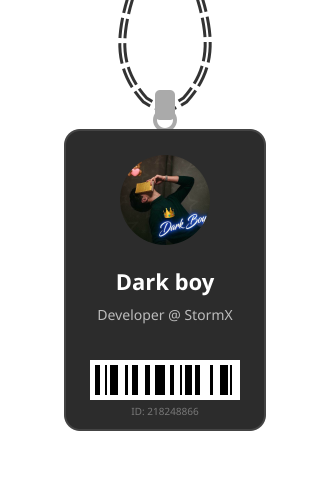

<!-- ✨ Animated Banner ✨ -->
<picture>
  <source media="(prefers-color-scheme: dark)" srcset="./banner.svg">
  <source media="(prefers-color-scheme: light)" srcset="./banner-light.svg">
  
</picture>

 

<table align="center" border="0">
<tr>
<td width="38%" align="center" valign="middle">

<!-- 🪪 Swinging Lanyard ID Card (React Bits style, pure SVG) -->

</td>
<td width="62%" valign="middle">

### 💻 My Projects Portfolio

| 🚀 Project | 🛠 Tech | ⭐ |
|:---|:---:|:---:|
| [🌟 Project Name 1](https://github.com/your-username/project-1) | `React` `Tailwind` `Node.js` | 15 |
| [🎨 Project Name 2](https://github.com/your-username/project-2) | `HTML` `CSS` `JS` | 10 |
| [⚡ Project Name 3](https://github.com/your-username/project-3) | `Python` `Django` | 8 |
| [📱 Project Name 4](https://github.com/your-username/project-4) | `React Native` | 5 |
| [🌐 Project Name 5](https://github.com/your-username/project-5) | `TypeScript` `Next.js` | 2 |

 

> 💡 *"Talk is cheap. Show me the code."*

</td>
</tr>
</table>

 

  <!-- Feel free to add github stats or other badges here -->

